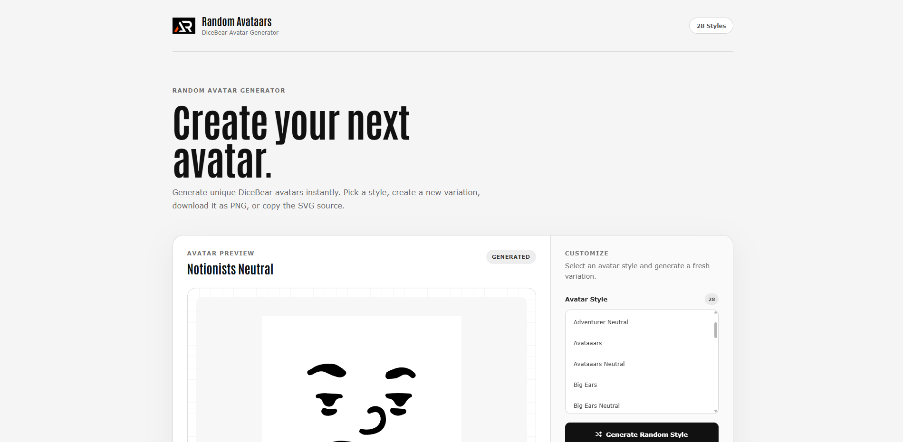

# Random Avataars

A modern and responsive random avatar generator built with React, Vite, and DiceBear. Generate unique avatars from multiple styles, create completely random variations, download avatars as PNG images, or copy the generated SVG source.

## Live Demo

https://a2rp.github.io/avataars/

## Preview



## Features

- Generate unique avatars using DiceBear
- 28 different avatar styles
- Random Style mode for generating avatars across all available styles
- Generate new variations within a selected style
- Vertically scrollable avatar style selector
- Displays the actual generated avatar style
- Unique seed generation for every avatar
- Download generated avatars as PNG
- Export PNG images at 1024 x 1024 resolution
- Copy generated avatar SVG directly to the clipboard
- Responsive desktop and mobile layout
- Modern black, white, and gray interface
- Reusable component-based React architecture
- Toast notifications for user actions
- Accessible buttons and interactive controls
- Custom branding and responsive footer
- Deployed with GitHub Pages

## Avatar Styles

The application currently includes 28 DiceBear avatar styles:

- Adventurer
- Adventurer Neutral
- Avataaars
- Avataaars Neutral
- Big Ears
- Big Ears Neutral
- Big Smile
- Bottts
- Bottts Neutral
- Croodles
- Croodles Neutral
- Fun Emoji
- Icons
- Identicon
- Initials
- Lorelei
- Lorelei Neutral
- Micah
- Miniavs
- Notionists
- Notionists Neutral
- Open Peeps
- Personas
- Pixel Art
- Pixel Art Neutral
- Rings
- Shapes
- Thumbs

The **Random Style** option automatically selects one of these styles whenever a new avatar is generated.

## Tech Stack

- React
- Vite
- JavaScript
- DiceBear
- styled-components
- React Icons
- React Toastify
- html-react-parser
- copy-to-clipboard
- ESLint
- GitHub Pages

## Project Structure

```text
avataars/
├── public/
│   ├── favicon.ico
│   ├── logo.png
│   └── preview.png
├── src/
│   ├── components/
│   │   ├── AvatarControls/
│   │   │   ├── index.jsx
│   │   │   └── styled.js
│   │   ├── AvatarPreview/
│   │   │   ├── index.jsx
│   │   │   └── styled.js
│   │   ├── Footer/
│   │   │   ├── index.jsx
│   │   │   └── styled.js
│   │   └── Header/
│   │       ├── index.jsx
│   │       └── styled.js
│   ├── data/
│   │   └── links.js
│   ├── App.jsx
│   ├── avataarStyles.js
│   ├── index.css
│   ├── main.jsx
│   ├── randomAvataar.jsx
│   └── styled.js
├── .gitignore
├── eslint.config.js
├── index.html
├── LICENSE
├── package.json
├── package-lock.json
├── README.md
├── screenshot.png
└── vite.config.js
```

## Getting Started

### Prerequisites

Make sure Node.js and npm are installed on your system.

### Clone the Repository

```bash
git clone https://github.com/a2rp/avataars.git
cd avataars
```

### Install Dependencies

```bash
npm install
```

### Start Development Server

```bash
npm run dev
```

Open the local URL displayed by Vite in your browser.

## Available Scripts

### Development

```bash
npm run dev
```

Starts the Vite development server.

### Lint

```bash
npm run lint
```

Checks the project with ESLint.

### Production Build

```bash
npm run build
```

Creates the optimized production build inside the `dist` directory.

### Preview Production Build

```bash
npm run preview
```

Runs the production build locally for testing.

### Deploy

```bash
npm run deploy
```

Builds and publishes the application to GitHub Pages.

## How to Use

1. Open the application.
2. Select **Random Style** to generate avatars from any available style, or choose a specific avatar style.
3. Click **Generate Random Style** or **Generate New Avatar** to create another variation.
4. Review the generated style and unique seed in the preview section.
5. Click **Download PNG** to save the avatar as a PNG image.
6. Click **Copy SVG** to copy the generated SVG markup to the clipboard.

## Deployment

The project is configured for GitHub Pages using the Vite base path:

```js
base: "/avataars/";
```

Production source maps are disabled.

The application is deployed using the `gh-pages` package.

Live application:

https://a2rp.github.io/avataars/

## Author

**Ashish Ranjan**  
Full-Stack Web Developer

## Links

- Portfolio: https://www.ashishranjan.net
- GitHub: https://github.com/a2rp
- CodePen: https://codepen.io/ash1198
- LinkedIn: https://www.linkedin.com/in/aashishranjan
- Facebook: https://www.facebook.com/theash.ashish/
- YouTube: https://www.youtube.com/@ashishranjan-ashz?sub_confirmation=1
- Email: mailto:ash.ranjan09@gmail.com

## Support

If you find this project useful and would like to support my work:

https://a2rp-donation-page.netlify.app/

## License

This project is licensed under the MIT License.

See the [LICENSE](LICENSE) file for details.

---

Copyright © 2026 Ashish Ranjan. All rights reserved.
