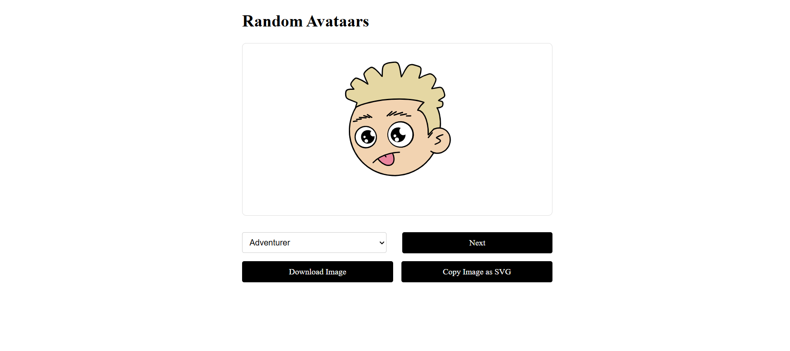

# React + Vite

# 🎨 Random Avatar Generator

live - https://random-avataars-a2rp.netlify.app/

A simple React app to generate random avatars using [Dicebear](https://www.dicebear.com/) avatar styles.



## ✨ Features

-   Generate avatars in 25+ unique styles
-   Download avatar as PNG
-   Copy avatar as SVG code
-   Fully responsive and styled with `styled-components`

## 🚀 Tech Stack

-   ReactJS
-   styled-components
-   @dicebear/core
-   react-icons
-   react-toastify
-   copy-to-clipboard
-   html-react-parser

## 📦 Getting Started

```bash
# Install dependencies
npm install

# Start the app
npm run dev


```
